The project uses API From:

 

# FlixTracker

1. A desktop App where a user will get recommendations based on their preferences.
2. Users can keep a track of their favourite movies using the "watchlist" feature on the sidebar
3. Users also have the option to create their personalized playlist using the "playlist" feature on the sidebar
4. Users also get to see the latest movies on the homepage.
5. Movies are fetched using TMDB API

To use this application, you have to first register on [TMDB](https://www.themoviedb.org/) and generate an API Key.
Now, replace "Enter API Key Here" string with your API Key.

**Login**

1. User is supposed to enter the username and password here
   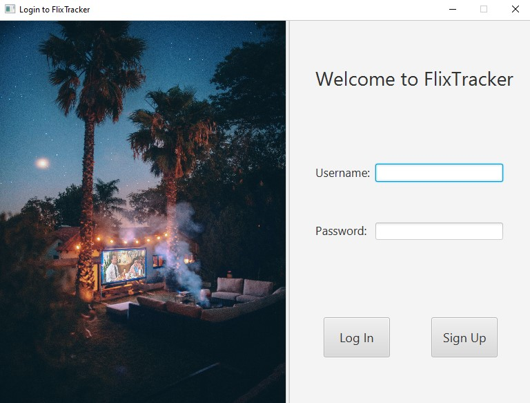2. After clicking "login", backend checks the "user" table in the database and verifies the details.

- In case, the details don't match, the following messages shows up:
  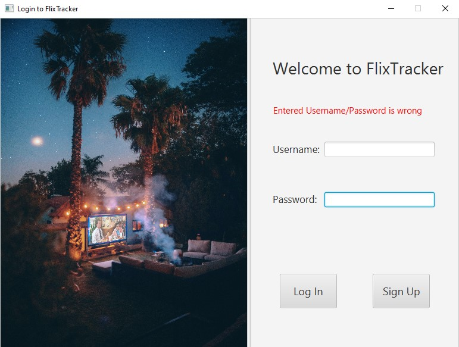

- If details match, dashboard opens. (Described in a section below)

**Sign Up**
1. User Registration screen opens as soon as user hits "Sign Up" on the "Login" Screen.
   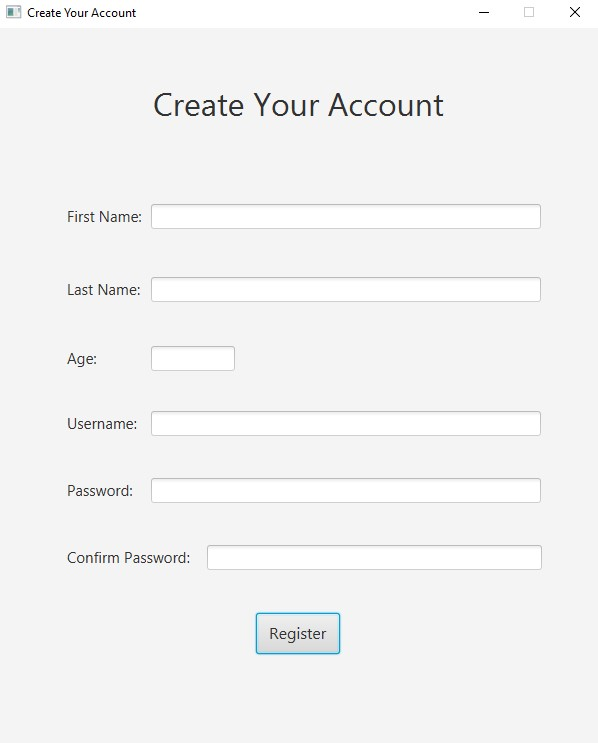

2. User must fill "First Name", "Last Name", "Age", "Username", "Password" & "Confirm Password".
- Username must be unique and this is verified as soon as user clicks "Register".
- In case the username is not unique, the app does not move forward and gives a warning message.
3. As soon as user clicks "Register", backend matches the "Password" & "Confirm Password" fields & enters details into the "user" table. Then, the "Select Genre" screen opens.
   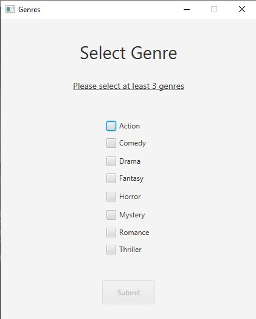
4. Backend inserts a record in the "genre" table to keep track of genre ratings (which influence the feed) when user clicks "Submit".

**Dashboard**
1. Home page of the dashboard fetches the latest movies from the TMDB API and displays them on the screen
   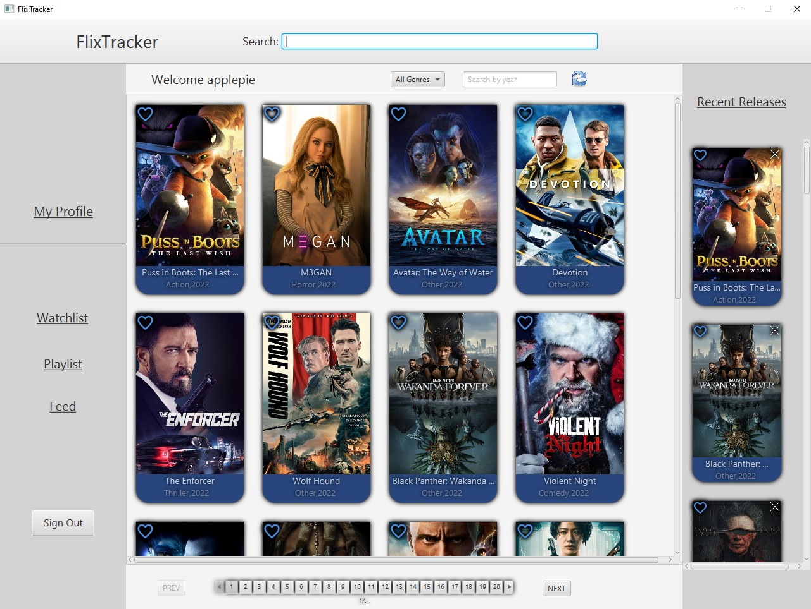
2. Multiple pages are displayed and can be navigated using the "Next" and "Previous" button
3. Sidebar has multiple options like "Movies", "Watchlist", "Feed", "Friends", "Playlist"

**Feed**
1. Feed page shows movies based upon the user's like history and preferred genres (taken at the time of signup).
   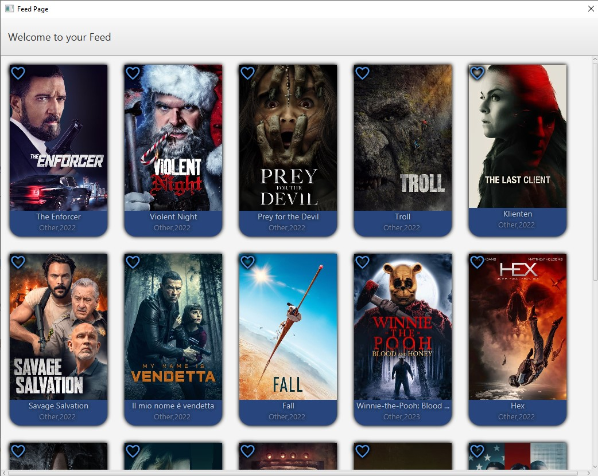

**Watchlist**
1. Watchlist page shows all of the user's liked movies.
   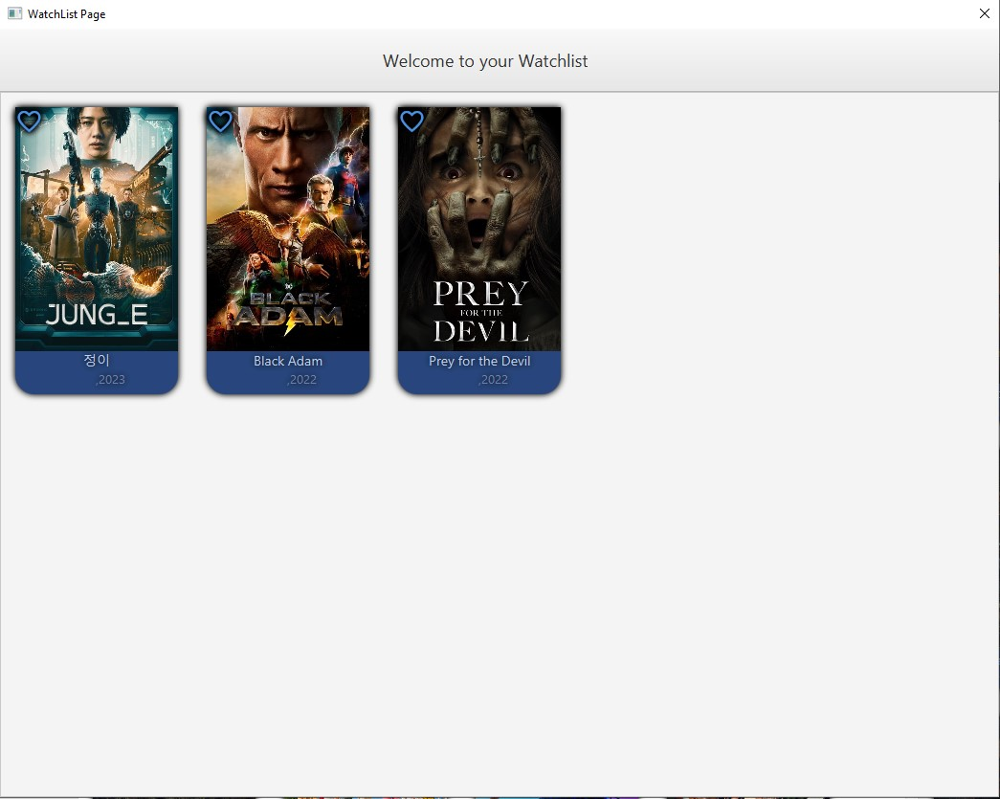

**Playlist**
1. Playlist page shows all of the user's add to playlist movies.
   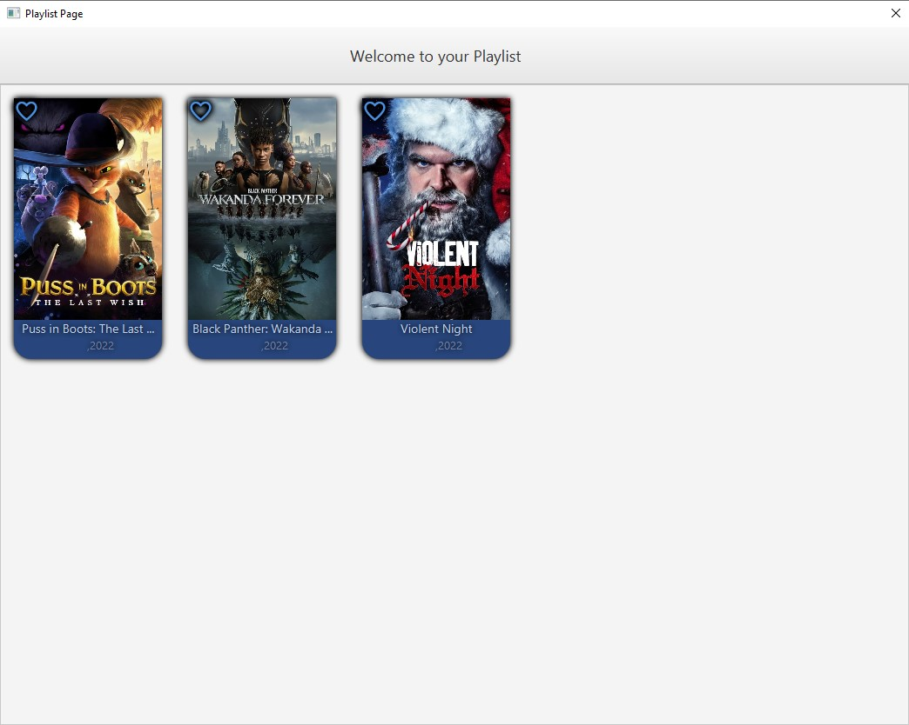

**Search By Movie Name**
1. User can Search Movies by its Name
   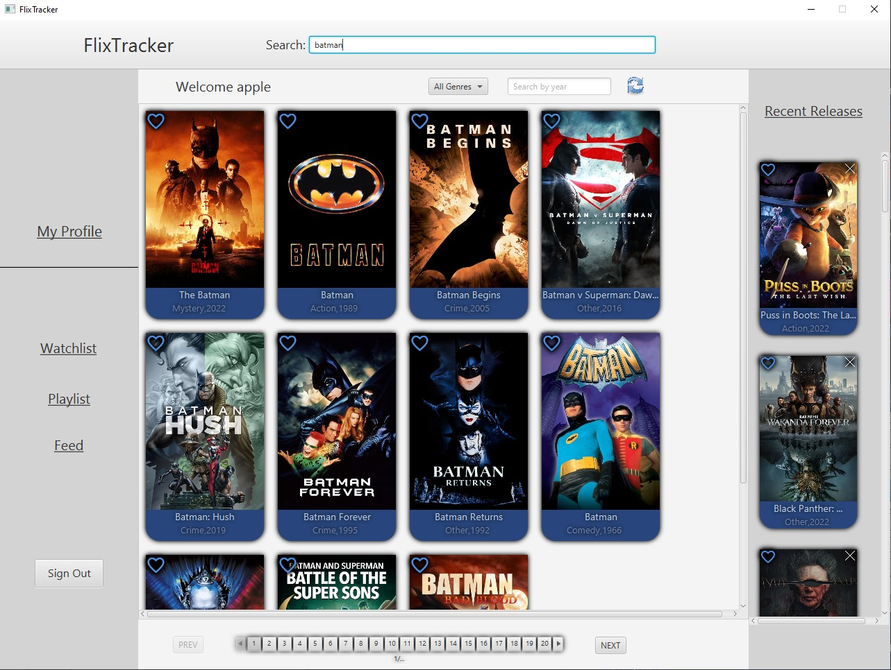

**Search By Genre**
1. User can Search Movies based on Genre type of the Movie  
   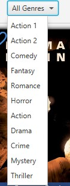

**Search By Release Year**
1. User can Search Movies by its Year of Release  
 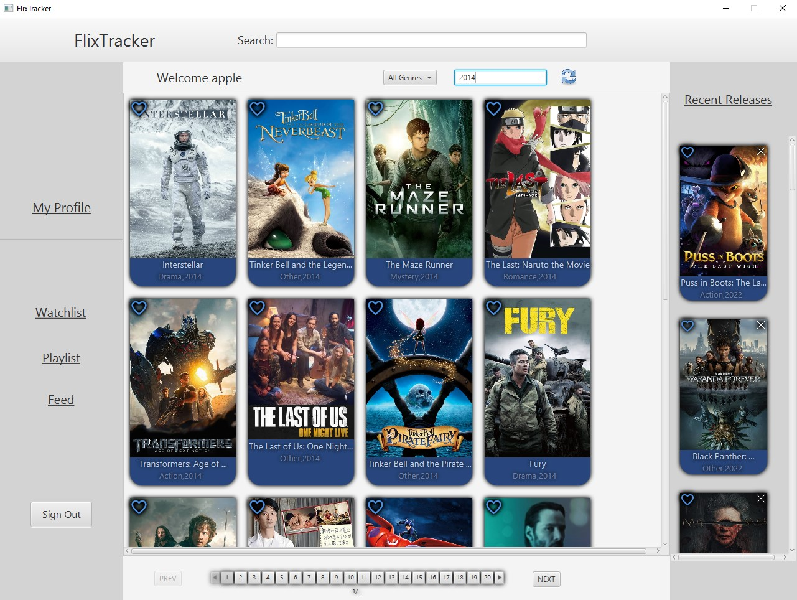

**Movie Info**
1. When User clicks on movie poster this page shows him full detail of movies
2. Here User can also add Movies to its playlist, watchList
   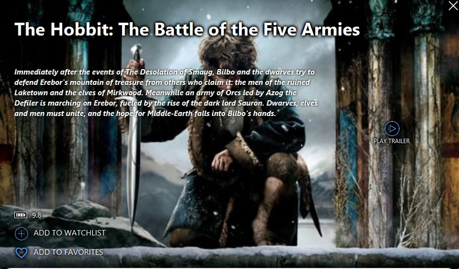

**Trailer**
1. This page shows Trailer of selected Movie
   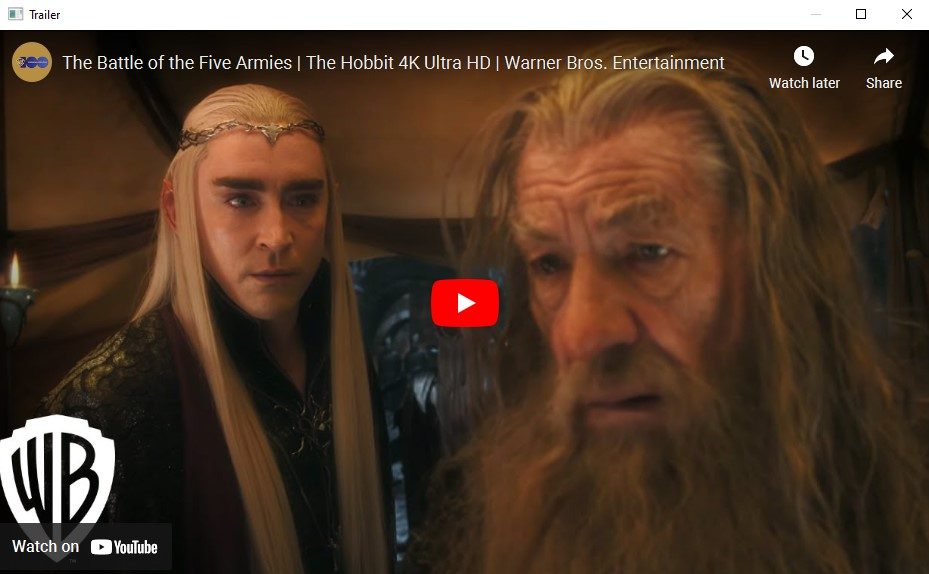

